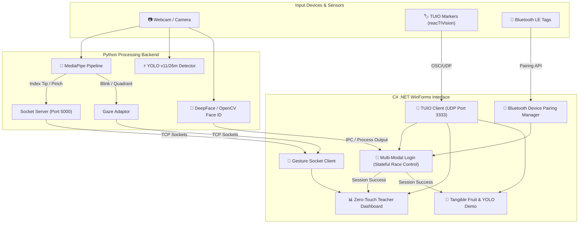

# 🌟 Multi-Modal Interactive HCI Framework
### TUIO Tangible Tables × YOLO Deep Learning × MediaPipe Hand Gesture & Gaze Tracking

[](https://dotnet.microsoft.com/)
[](https://www.python.org/)
[](https://ultralytics.com)
[](https://mediapipe.dev)
[](http://www.tuio.org/)

---

## 📖 Overview

This repository hosts a state-of-the-art **Multi-Modal Human-Computer Interaction (HCI) Framework** that bridges physical tangible tabletop systems with advanced deep learning computer vision models. 

By fusing **TUIO tangible markers**, **YOLO object detection**, **MediaPipe eye/hand-gaze trackers**, and **Bluetooth LE active pairing**, this project creates an immersive, "zero-touch" interactive playground designed specifically for student education and teacher tracking.



---

## ✨ Key Features

### 1. 🔑 Stateful Multi-Modal Authentication
A three-lane parallel registration and sign-in engine managed by `LoginForm.cs`:
* **Deep Face Identification**: Automatically launches an OpenCV camera preview window running a deep-learning face-matching module (`python/people_face_login.py`). It authenticates recognized users against enrolled student or teacher profiles.
* **Tangible TUIO Cards**: Show physical fiducial markers (IDs 0–7) via reacTIVision to sign in instantly as a student.
* **Bluetooth LE Active Beaconing**: Actively scans for BLE hardware. Bringing a registered tag close pairs the device and signs in the student's personal profile.
* **Race Control & Fallback Queue**: Face login takes high priority while TUIO/BLE events are queued in the background. If Face ID is skipped or fails, the queued fallback credentials are automatically evaluated to complete login.

### 2. 📊 Zero-Touch Teacher Dashboard
A state-of-the-art administrative canvas (`TeacherDashboardForm.cs`) powered by multi-sensory physical and touchless controls:
* **Dual-Mode Dynamic Cursor**:
  * **Hand Skeleton Tracking (Primary)**: Powered by MediaPipe Hand Landmarker via `python/gesture_server.py`. Tracks the index finger tip for precise positioning. Supports **1-second hover dwell selection** or **Pinch-to-select** gestures.
  * **Gaze Tracking (Fallback)**: When no hand is visible in the frame, it falls back to a MediaPipe eye-tracker. Tracks screen quadrants (`center-mid`, `up-left`, etc.) and locks coordinates during blinks to prevent screen drift.
* **Interactive Zero-Touch CRUD Operations**:
  * **Interactive Dwell Ring**: Provides animated circular countdown rings during dwell hover to notify users before selection.
  * **TUIO Difficulty Toggles**: Physical tabletop markers update the selected student's task difficulty in real-time (Marker 11 = Easy, 12 = Medium, 13 = Hard).
  * **Dynamic Age & Role Bumpers**: Marker 14 increments student age, Marker 15 decrements it, and Marker 16 cycles roles (Child ⇋ Teacher ⇋ Admin).
  * **Two-Step Secure Deletion**: Placing Marker 17 triggers an "armed deletion" state, showing a red flashing banner with a shrinking countdown bar (5 seconds). The administrator must perform a physical **pinch gesture** within this window to commit the database deletion. Lifting the marker or shifting focus instantly aborts the deletion.
  * **Proximity Warnings**: Continuous sensor analysis gives real-time distance warning alerts ("📏 Please step back!" or "👋 Come a little closer!").

### 3. 🍎 TUIO + YOLO Tangible Fruit App
A tangible computer-vision application (`TuioDemoYolo.cs` & `YoloEnhancedInterface.cs`):
* Combines **YOLOv11** or **YOLO26m** real-time deep-learning object recognition with TUIO fiducial tracking.
* Allows placing physical objects (cups, bowls, fruits) under the camera. The app frames real-time objects, matches coordinates, and binds them to C# virtual objects.
* Includes a **custom fruit training pipeline** (`train_fruit_model.py`, `prepare_dataset.py`) for compiling datasets, annotating custom fruits via `labelImg`, and training weights (`best.pt`).

---

## 📂 Project Architecture

```
📂 TUIO11_NET-master
├── 📂 OSC.NET                      # Custom OpenSound Control parser (UDP)
├── 📂 TUIO                         # Core C# TUIO 1.1 protocol client library
├── 📂 GestureClient                 # TCP Socket Client linking C# application to Python
│   ├── GestureSocketClient.cs       # TCP Socket client for streaming gesture events
│   └── IGestureListener.cs          # Interface handling skeleton, gaze, and emotion updates
├── 📂 GazeTracking                  # MediaPipe Eye Tracking library
│   ├── eye_tracker.py               # MediaPipe FaceLandmarker eye-gaze tracker
│   ├── main.py                      # Standalone gaze quadrant calibration utility
│   └── calibrate.py                 # Interactive screen-quadrant calibration
├── 📂 python                        # Python Machine Learning and Socket Servers
│   ├── requirements.txt             # Unified Python dependencies file
│   ├── gesture_server.py            # MediaPipe Hand/Gaze TCP Socket Server (Port 5000)
│   ├── people_face_login.py         # OpenCV / DeepFace authentication daemon
│   ├── enroll_face.py               # Utility to capture photos and enroll new face profiles
│   ├── train_fruit_model.py         # Custom Ultralytics YOLOv11/v26 training script
│   └── yolo_tuio_bridge.py          # Bridges YOLO detection bounding boxes to TUIO objects
├── LoginForm.cs                     # Frameless, kid-friendly stateful login manager
├── TeacherDashboardForm.cs          # Zero-touch, touchless admin dashboard
├── TuioDemoYolo.cs                  # TUIO + YOLO deep learning integration application
├── TuioDemo.cs                      # Baseline TUIO spatial drawing canvas
├── BluetoothDevicePairingManager.cs  # Windows Bluetooth LE proximity pairing service
├── UserProgressStore.cs             # Local persistence and student database
└── TUIO_CSHARP.sln                  # Visual Studio Solution compiling all projects
```

---

## 🛠️ Installation & Setup

### Prerequisites
* **Windows 10/11**
* **Visual Studio 2022** (with .NET Desktop Development workload)
* **Python 3.11 or 3.12**
* **reacTIVision** (or another TUIO tracker/simulator)

---

### Step 1: Clone & Compile the C# Solution
1. Open the solution in Visual Studio:
   ```bash
   start TUIO_CSHARP.sln
   ```
2. Restore NuGet Packages if prompted.
3. Switch build configuration to **Release** or **Debug** (x86 or x64 matching your system).
4. Build the Solution (`Ctrl+Shift+B`). This compiles:
   * `TUIO_LIB.dll` (TUIO Protocol Library)
   * `TUIO_DEMO.exe` (Draws object/cursor states)
   * `TUIO_YOLO.exe` (Integrated Tangible Vision Application)
   * `TUIO_DUMP.exe` (Debug console printer)

---

### Step 2: Configure Python Virtual Environment
1. Open a terminal in the root directory and set up the virtual environment:
   ```powershell
   py -3.12 -m venv python\.venv
   python\.venv\Scripts\activate
   ```
2. Upgrade `pip` and install the required machine learning dependencies:
   ```bash
   pip install --upgrade pip
   pip install -r python/requirements.txt
   ```
   > [!IMPORTANT]
   > For hardware-accelerated training (GPU support in PyTorch), make sure you have the matching CUDA Toolkit installed, then reinstall PyTorch:
   > ```bash
   > pip install torch torchvision --index-url https://download.pytorch.org/whl/cu121
   > ```

---

### Step 3: Run the reacTIVision Camera Server
Download and launch reacTIVision to track physical markers. You can use the provided batch script to fetch it:
```powershell
.\download_reactivision.bat
```
Run `reacTIVision.exe` to start scanning physical markers on your tracking table and streaming TUIO packets on UDP Port `3333`.

---

## 🚀 Running the System

To experience the full multi-modal power of the framework, run the servers in parallel:

### 1. Zero-Touch Gesture Server (MediaPipe Backend)
Start the gesture socket server to stream hand gestures, skeletal positions, and gaze tracking to the C# front-end:
```bash
# In python/.venv terminal:
python python/gesture_server.py --port 5000
```

### 2. Enroll Your Face (Optional)
To log in with Face Identification, enroll your face under a specific profile:
```bash
# Register a profile (e.g. child or teacher)
python python/enroll_face.py --name "Dr. Ayman" --role teacher
```

### 3. Launch the Multi-Modal Login
Run the C# Application. The `LoginForm` automatically opens. 
* It attempts to open the face scanning camera in a parallel process.
* If a face is found and verified against `python/people/`, it logs in automatically.
* Alternatively, show TUIO Marker `0-7` to the webcam or tap a paired Bluetooth device to log in.

---

## 🎯 Dashboard Interaction Cheat Sheet

When logged in as a **Teacher** on the zero-touch administrative dashboard, you can interact completely hands-free:

### Hand & Eye Tracking Navigation
* **Cursor Navigation**: Point your index finger at the screen. A cyan cursor crosshair tracks your finger.
* **Fallback Navigation**: If you drop your hand, the cursor shifts to a red gaze dot tracking your eyes.
* **Hover Selection**: Hover your cursor over a student tile for **1 second** (progress ring fills).
* **Pinch Gesture**: Instantly selects the hovered student tile without waiting for the 1-second dwell.

### Tangible TUIO Table Markers
When a student is selected, place physical TUIO fiducial markers on the table to perform updates:

| Marker ID | Dashboard Action | Description / Details |
| :---: | :--- | :--- |
| **11** | `Difficulty ➔ Easy` | Updates student profile difficulty to Easy (Green indicator) |
| **12** | `Difficulty ➔ Medium` | Updates student profile difficulty to Medium (Gold indicator) |
| **13** | `Difficulty ➔ Hard` | Updates student profile difficulty to Hard (Orange/Red indicator) |
| **14** | `Age +1` | Increments student age in the database |
| **15** | `Age -1` | Decrements student age in the database |
| **16** | `Cycle Role` | Cycles user roles: `Child` ⇋ `Teacher` ⇋ `Admin` |
| **17** | `Arm Student Delete` | Triggers armed deletion state. You must **pinch your fingers** within **5 seconds** to confirm. Lifting the marker cancels. |

---

## 🍎 Training Custom YOLO Fruit Models

You can train a custom YOLO model to detect fruits (or any custom objects) on your tangible table:

### 1. Compile the Dataset
Prepare a local image dataset from folder files:
```bash
python python/train_fruit_model.py --prepare --source bin/Debug
```

### 2. Annotate Bounding Boxes
Annotate your fruit images using `labelImg`:
```bash
pip install labelImg
labelImg
```
1. Open the image folder `fruit_dataset/images/train/`.
2. Draw bounding boxes around fruits and save annotations in **YOLO** format to the matching `labels` folder.

### 3. Run Custom Training
Train your custom weights using the provided configuration:
```bash
python python/train_fruit_model.py --train --epochs 50 --img 640
```
This produces optimized model weights at `runs/detect/train/weights/best.pt`.

### 4. Run Combined Real-time Application
Launch the integrated TUIO + YOLO application:
```bash
# Terminal 1: Run C# integrated demo
bin/Release/TUIO_YOLO.exe

# Terminal 2: Run Python video + YOLO tracker bridge
python python/yolo_tuio_bridge.py --model runs/detect/train/weights/best.pt
```

---

## 📜 License & Acknowledgments

* **TUIO C# Library**: Based on Martin Kaltenbrunner's reacTIVision open-source framework, distributed under the **GNU Lesser General Public License (LGPL v3.0)**.
* **OSC.NET**: Utilizes the OpenSound Control library with modifications.
* **Deep Learning Frameworks**: Built using [MediaPipe](https://google.github.io/mediapipe/) and [Ultralytics YOLO11](https://github.com/ultralytics/ultralytics).

